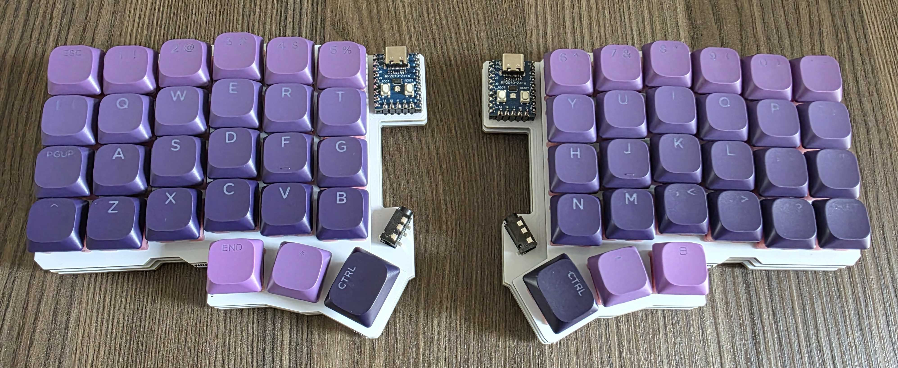
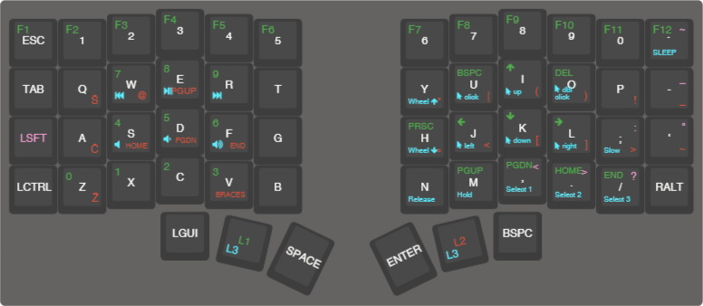

# Custom Silakka54 keymap

This is my personal configuration for the [Silakka54](https://squalius-cephalus.github.io/silakka54/) keyboard, tailored for the Slovenian QWERTZ layout.
It adds smarter shift keys, tap dances, combos, and macros to make typing symbols and navigation faster.



## Features

- Custom shift keys
- Tap-dances:
  - Shift -> Caps Lock
  - LGui -> Alt
- Combos:

- Macros for character pairs such as parenthesis, quotes, brackets and braces

🔤 Custom Shift Keys

Redefines shift behavior for certain symbols to match the Slovenian layout and make typing common characters easier:

- `.` → `>`

- `,` → `<`

- `;` → `:`

- `/` → `?`

- `-` → `_`

- `'` → `"`

- `~` → `#`

- `*` → `%`

- `^` → `` ` ``

- `+` → `-`

- `$` → `€`

- `` ` `` → `~`

🎭 Tap Dance Keys

* Left Shift / Caps Lock → Tap once for Shift, tap twice for Caps Lock.

* LGUI / LALT → Tap once for GUI (Super/Command/Windows key), tap twice for Alt.

🤝 Combos

* MO(1) + MO(2) → MO(3) (quick access to the fourth layer when both lower/raise layers are held).

🪄 Macros

* Braces Macro → Types paired characters and places the cursor in between:

  * `()`

  * `[]` (when Ctrl is held)

  * `{}` (when Shift is held)

  * `<>` (when Ctrl+Shift is held)

## ⌨️ Keymap Overview
### Layer 0 – Base Layer

QWERTZ Slovenian layout with tap dances and custom shift symbols.

### Layer 1 – Function / Navigation

* F1–F12

* Navigation: arrows, Home/End, Page Up/Down

* Screenshot and Delete shortcuts

### Layer 2 – Symbols / Coding

* Special characters with carons

* Easy access to @, =, [], {}, <>, etc.

* Braces macro for structured typing.

* Mathematical and logical symbols (*, +, |, ^, &).

### Layer 3 – System / Media / Mouse

* Media controls: play, pause, next, previous, mute, volume.

* Sleep key.

* Mouse controlls (movement, buttons, scroll, and drag macros).



## Installations

1. Fork and clone QMK
```
git clone https://github.com/<github_username>/qmk_firmware.git
```
2. [Set up your environment](https://docs.qmk.fm/newbs_getting_started)

2. Clone this repo
```
git clone https://github.com/jasasuster/silakka54-config.git
```

4. Copy `config.h` into `qmk_firmware/keyboards/silakka54`
5. Copy `keymap.c`, `keymap.json` and `rules.mk` into `qmk_firmware/keyboards/silakka54/<github_username>`

6. Compile and flash
```
qmk compile -kb silakka54 -km <github_username>
```